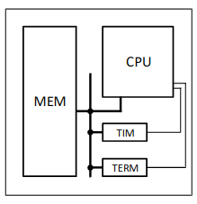

System Software Project

Course link: [13SS113SS](https://www.etf.bg.ac.rs/en/fis/karton_predmeta/13S113SS-2013)

# Table of contents

- [Table of contents](#table-of-contents)
- [Tasks](#tasks)
  - [Assembler](#assembler)
    - [Usage](#usage)
      - [Options](#options)
    - [Source code syntax](#source-code-syntax)
      - [General information](#general-information)
      - [Assembler directives](#assembler-directives)
      - [Assembler instructions](#assembler-instructions)
      - [Registers and operands](#registers-and-operands)
  - [Linker](#linker)
    - [Usage](#usage-1)
      - [Options](#options-1)
    - [Example](#example)
  - [Emulator](#emulator)
    - [Usage](#usage-2)
    - [Input](#input)
    - [Output](#output)
- [Computer system description](#computer-system-description)
  - [Introduction](#introduction)
  - [The processor](#the-processor)
    - [Processor registers](#processor-registers)
    - [Memory mapped registers](#memory-mapped-registers)
    - [Interrupt mechanism](#interrupt-mechanism)
    - [Instruction format](#instruction-format)
    - [Processor instruction overview](#processor-instruction-overview)
      - [halt](#halt)
      - [interrupt](#interrupt)
      - [subroutine calls](#subroutine-calls)
      - [jump instructions](#jump-instructions)
      - [atomic swap](#atomic-swap)
      - [arithmetic operations](#arithmetic-operations)
      - [logic instructions](#logic-instructions)
      - [shift instructions](#shift-instructions)
      - [data storing instructions](#data-storing-instructions)
      - [data loading instructions](#data-loading-instructions)
  - [The peripherals](#the-peripherals)
    - [The terminal](#the-terminal)
      - [`term_out`](#term_out)
      - [`term_in`](#term_in)
    - [The timer](#the-timer)
      - [`timer_cfg`](#timer_cfg)
  - [Example of a *user program*](#example-of-a-user-program)

# Tasks

The project consists of three tasks:

1) The assembler
2) The linker
3) The emulator

The use of non-standard libraries (if they are not closely linked to the core of the project) is allowed

## Assembler

### Usage

`asembler [options] <input_file>`

#### Options

- `-o <output_file>` - specifies output name and destination

### Source code syntax

#### General information

- One line of source code shall contain at most one instruction or directive
- Comments are completely ignored during the assembly process
- One line comments, located at the end of a line, begin with the `#` character
- A label, which ends with `:`, must be located at the very beginning of a line of source code
- A label may exist 'as its own line', without a following assembler instruction or directive, in this case it is equivalent as being at the beginning of the next line of source code which contains an instruction/directive

#### Assembler directives

- `.global <symbol_list>` - Exports all symbols within `<symbol_list>`. The list may contain one, or more comma separated symbols
- `.extern <symbol_list>` - Imports all symbols within `<symbol_list>`. The list may contain one, or more comma separated symbols
- `.section <section_name>` - Starts a new assembler section, which implicitly marks the end of the previous section, with the desired name
- `.word <symbol_or_literal_list>` - Allocates a fixed amount of space in 4 byte increments for each initializer (symbol or literal) within the supplied, comma separated list. The directive initializes the space with the value of the initializers
- `.skip <literal>` - Allocates space whose size is equal to the literal supplied. The directive initializes the space with zeroes
- `.ascii <string>` - Allocates a fixed amount of space 1 byte increments for each character of the supplied string. The directive initializes the space with the value of the supplied string
- `.equ <new_symbol>, <expression>` - Defines a new symbol whose value is equal to the supplied expression
- `.end` - Ends the process of assembling the input file. The contents of the file following this directive are discarded and are not assembled

#### Assembler instructions

- `halt` - Ceases the execution of instructions
- `int` - Causes a software interrupt
- `iret` - `pop pc; pop status;`
- `call operand` - `push pc; pc <= operand`
- `ret` - `pop pc;`
- `jmp operand` - `pc <= operand`
- `beq %gpr1, %gpr2, operand` - `if (gpr1 == gpr2) pc <= operand`
- `bne %gpr1, %gpr2, operand ` - `if (gpr1 != gpr2) pc <= operand`
- `bgt %gpr1, %gpr2, operand ` - `if (gpr1 signed > gpr2) pc <= operand`
- `push %gpr ` - `sp <= sp -4; mem32[sp] <= gpr`
- `pop %gpr ` - `gpr <= mem32[sp]; sp <= sp + 4`
- `xchg %gprS, %gprD ` - `temp <= gprD; gprD <= gprS; gprS <= temp`
- `add %gprS, %gprD ` - `gprD <= gprD + gprS`
- `sub %gprS, %gprD ` - `gprD <= gprD - gprS`
- `mul %gprS, %gprD ` - `gprD <= gprD * gprS`
- `div %gprS, %gprD ` - `gprD <= gprD / gprS`
- `not %gpr ` - `gpr <= ~gpr`
- `and %gprS, %gprD ` - `gprD <= gprD & gprS`
- `or %gprS, %gprD ` - `gprD <= gprD | gprS`
- `xor %gprS, %gprD` - `gprD <= gprD ^ gprS`
- `shl %gprS, %gprD ` - `gprD <= gprD << gprS`
- `shr %gprS, %gprD ` - `gprD <= gprD >> gprS`
- `ld operand, %gpr ` - `gpr <= operand`
- `st %gpr, operand ` - `operand <= gpr`
- `csrrd %csr, %gpr ` - `gpr <= csrAcsrwr %gpr, %csrcsr <= gpr`

#### Registers and operands

Above, the label `gprX` represents one of the programmatically available general purpose registers, which are: `r0`, `r1`, `r2`, `r3`, `r4`, `r5`, `r6`, `r7`, `r8`, `r9`, `r10`, `r11`, `r12`, `r13`, `r14/sp`, `r15/pc`
The label `csrX` represents one of the programmatically available control and status registers, which are: `status`, `handler`, `cause`
The label `operand` represents all syntax notations for labeling operands. Syntax notations differ between jump instructions or instructions which deal with data.
Data notations:

- `$<literal>` - the value `<literal>`
- `$<symbol>` - the value of `<symbol>`
- `<literal>` - the memory value at `<literal>`
- `<symbol>` - the memory value at `<symbol>`
- `%<reg>` - the value inside the register `<reg>`
- `[%<reg>]` - the memory value at address `<reg>`
- `[%<reg> + <literal>]` - the memory value at address `<reg> + <literal>`
- `[%<reg> + <symbol>]` - the memory value at address `<reg> + <symbol>`
  Jump and subroutine notations:
- `<literal>` - the value of `<literal>`
- `<symbol>` - the value of `<symbol>`

## Linker

### Usage

`linker [options] <input_file> ...`


#### Options

ONE and ONLY ONE of the `-relocatable`,`-hex` options must be specified when using the linker.

- `-o <output_file>` - Specifies output file of the command.
- `-place=<name_of_section>@<address>` - Explicitly defines the start address of a section. Can be used multiple times to set the addresses of multiple sections. All sections for which this option is not used are placed using the default placement method.
- `-hex` - Tells the linker to generate a hex representation of the program, for purposes of memory initialization. The contents of this hex dump represent the machine code paired to its address in the program. Data is only generated for addresses with defined starting values. The format is as follows:
  ```bash
  0000: 00 01 02 03 04 05 06 07
  0008: 08 09 0A 0B 0C 0D 0E 0F
  0010: 10 11 12 13 14 15 16 17
  ```
-`relocatable` - Tells the linker to output a relocatable object file, of the same format as the output of the [assembler](#assembler) in which all sections are placed at the `NULL` address and all `-place` options are completely ignored. The resulting relocatable program may later be used as input for the linker. 


Linking is only possible when:
1) There exists no symbol with multiple definitions
2) Unresolved symbols
3) Overlap between sections (when `-place` options are taken into consideration)

### Example

An example of the command used to link object files `in1.o` and `in2.o`, with the sections `data` and `text` placed at addresses `0x4000F000` and `0x40000000` respectively, with the output of the command being hex code for memory initialization purposes.

```bash
  ./linker -hex
  -place=data@0x4000F000 -place=text@40000000
  -o mem_content.hex
  in1.o in2.o
```

## Emulator

### Usage

`./emulator <input_file>`

### Input

The input file is a hex file used for memory initialization, the output of the [linker](#linker) with the `-hex` option set (see [linker options](#options-1) for more details).

### Output

The emulator does not output anything while the user program is working, that is to say until the `halt` command is executed. After the `halt` command the emulated processors state is printed to standard output in the following format:
```bash
-----------------------------------------------------------------
Emulated processor executed halt instruction
Emulated processor state:
 r0=0x00000000    r1=0x00000000    r2=0x00000000    r3=0x00000000
 r4=0x00000000    r5=0x00000000    r6=0x00000000    r7=0x00000000
 r8=0x00000000    r9=0x00000000   r10=0x00000000   r11=0x00000000
r12=0x00000000   r13=0x00000000   r14=0x00000000   r15=0x00000000
```

# Computer system description

## Introduction

The abstract computer system consists of:

- A processor (CPU)
- Operating memory (MEM)
- A timer (TIM)
- A terminal (TERM)
  All of the components mentioned above are interconnected via a system bus. Aside from this system bus the timer and the terminal are directly connected to the processor via interrupt causing lines.
  A simple diagram of this computer system is shown below.
  

## The processor

The processor is a simple 32-bit Von-Neuman architecture based processor.
The addressable unit is 1 byte (8 bits), and the byte order is little-endian.
The size of the physical memory space is $2^32$ bytes or $4$ gigabytes.
After both a *cold* and *warm* restart the processor starts executing instructions beginning at address `0x40000000`.

### Processor registers

The processor possesses sixteen 32-bit general purpose registers named `r<num>` where `<num>` is a number from $0$ to $15$.
The `r0` register is wired to zero, `r14` is used as the stack pointer (`sp`), and `r15` is the program counter register (`pc`).
The stack pointer (`sp` or `r14`) contains the address of the taken address at the top of the stack (the stack grows down towards lower addresses).
Besides the sixteen mentioned general purpose registers, the processor also has the following status and control 32-bit registers:
- `status` - the processor status word
- `handler` - the address of the interrupt routine
- `cause` - the cause of the interrupt
The `status` register contains flags which provide the ability to configure the interrupt mechanism, these flags are:
- `status[0]` $=>$ `Tr` - Timer, masks the timer interrupts ($0$ - enabled, $1$ - masked)
- `status[1]` $=>$ `Tl` - Terminal, masks the terminal interrupts ($0$ - enabled, $1$ - masked)
- `status[2]` $=>$ `I` - Interrupt, globally masks external interrupts ($0$ - enabled, $1$ - masked)
### Memory mapped registers
Memory mapped registers are registers which are accessed via memory instructions.
Starting at address `0xFFFFFF00` of the physical address space there exists a space of $256$ bytes reserved for memory mapped registers.
These registers are used for work with peripherals in the computer system.
### Interrupt mechanism
The system possesses only one interrupt routine whose address is defined by the value of the `handler` register.
The cause for entering the given interrupt routine is defined by the value of the `cause` register.
The possible values of `cause` are:
- $1$ - Incorrect instruction
- $2$ - Timer interrupt
- $3$ - Terminal interrupt
- $4$ - Software interrupt
Each instruction is atomic. The interrupt request is handled only after the current instruction is atomically finished.
When the processor enters the interrupt handler, it saves the `status` and `pc` registers to the stack and then masks all interrupts globally.
### Instruction format
Each instruction is 4 bytes long. The format of each instruction is as follows:
| 31...28 | 27...24 | 23...20 | 19...16 | 15...12 | 11...8 | 7...4 | 3...0 |
| ------- | ------- | ------- | ------- | ------- | ------ | ----- | ----- |
| OC | MOD | RegA | RegB | RegC | Disp | Disp | Disp |

The `OC` field represents the opcode of the instruction.
The `MOD` field represents the instruction modifier, it says exactly what the `OC[3..0]` instruction ought to do.
The field `RegX` represents one used register. For general purpose registers the value of `X`is self explanatory, $X=0$ for `r0`, $X=1$ for `r1`, ... The status and control registers have the following values:

| `status` | `handler` | `cause` |
| -------- | --------- | ------- |
| 0 | 1 | 2 |

The `Disp` field represents a signed displacement value. 
### Processor instruction overview
All combinations of instructions and operands for which there does not exist a reasonable interpretation are treated as errors.
#### halt
| 31...28 | 27...24 | 23...20 | 19...16 | 15...12 | 11...8 | 7...4 | 3...0 |
| ------- | ------- | ------- | ------- | ------- | ------ | ----- | ----- |
|  0000   |  0000   |  0000   |  0000   |  0000   |  0000  | 0000  | 0000  |

  Stops the processor as well as further instruction execution

#### interrupt
| 31...28 | 27...24 | 23...20 | 19...16 | 15...12 | 11...8 | 7...4 | 3...0 |
| ------- | ------- | ------- | ------- | ------- | ------ | ----- | ----- |
|  0001   |  0000   |  0000   |  0000   |  0000   |  0000  | 0000  | 0000  |

  Generates a software interrupt.
  > `push status; push pc; cause <= 4; status <= status & (~ 0x1); pc <= handle;`

#### subroutine calls
| 31...28 | 27...24 | 23...20 | 19...16 | 15...12 | 11...8 | 7...4 | 3...0 |
| ------- | ------- | ------- | ------- | ------- | ------ | ----- | ----- |
|  0010   |  MMMM   |  AAAA   |  BBBB   |  0000   |  DDDD  | DDDD  | DDDD  |

  Calls the subroutine, before which it saves the return address on the stack. Dependent on the modifier the jump address is calculated in the following way
  > `MMMM` $==$ `0b0000` : `push pc; pc <= gpr[A] + gpr[B] + D`
  > `MMMM` $==$ `0b0001` : `push pc; pc <= mem32[gpr[A] + gpr[B] + D]`


#### jump instructions
| 31...28 | 27...24 | 23...20 | 19...16 | 15...12 | 11...8 | 7...4 | 3...0 |
| ------- | ------- | ------- | ------- | ------- | ------ | ----- | ----- |
|  0011   |  MMMM   |  AAAA   |  BBBB   |  0000   |  DDDD  | DDDD  | DDDD  |

  > `MMMM` $==$ `0b0000` : `pc <= gpr[A] + D`
  > `MMMM` $==$ `0b0001` : `if(gpr[B] == gpr[C]) pc <= gpr[A] + D`
  > `MMMM` $==$ `0b0010` : `if(gpr[B] != gpr[C]) pc <= gpr[A] + D`
  > `MMMM` $==$ `0b0011` : `if(gpr[B] signed> gpr[C]) pc <= gpr[A] + D`
  > `MMMM` $==$ `0b1000` : `pc <= mem32[gpr[A] + D]`
  > `MMMM` $==$ `0b1001` : `if(gpr[B] == gpr[C]) pc <= mem32[gpr[A] + D]`
  > `MMMM` $==$ `0b1010` : `if(gpr[B] != gpr[C]) pc <= mem32[gpr[A] + D]`
  > `MMMM` $==$ `0b1011` : `if(gpr[B] signed> gpr[C]) pc <= mem32[gpr[A] + D]`
#### atomic swap
| 31...28 | 27...24 | 23...20 | 19...16 | 15...12 | 11...8 | 7...4 | 3...0 |
| ------- | ------- | ------- | ------- | ------- | ------ | ----- | ----- |
|  0100   |  0000   |  0000   |  BBBB   |  CCCC   |  0000  | 0000  | 0000  |

  Atomically swaps the values of two registers atomically (cannot be interrupted by asynchronous interrupt requests)
  > `temp <= gpr[B]; gpr[B] <= gpr[A]; gpr[A] <= tmp`

#### arithmetic operations
| 31...28 | 27...24 | 23...20 | 19...16 | 15...12 | 11...8 | 7...4 | 3...0 |
| ------- | ------- | ------- | ------- | ------- | ------ | ----- | ----- |
|  0101   |  MMMM   |  AAAA   |  BBBB   |  CCCC   |  0000  | 0000  | 0000  |

  Executes the specified arithmetic operation, in accordance to the instruction modifier, on values contained within the given registers.
  > `MMMM` $==$ `0b0000` : `gpr[A] <= gpr[B] + gpr[C]`
  > `MMMM` $==$ `0b0001` : `gpr[A] <= gpr[B] - gpr[C]`
  > `MMMM` $==$ `0b0010` : `gpr[A] <= gpr[B] * gpr[C]`
  > `MMMM` $==$ `0b0011` : `gpr[A] <= gpr[B] / gpr[C]`

#### logic instructions
| 31...28 | 27...24 | 23...20 | 19...16 | 15...12 | 11...8 | 7...4 | 3...0 |
| ------- | ------- | ------- | ------- | ------- | ------ | ----- | ----- |
|  0110   |  MMMM   |  AAAA   |  BBBB   |  CCCC   |  0000  | 0000  | 0000  |

  Executes the specified logic operation, in accordance to the instruction modifier, on values contained within the given registers.
  > `MMMM` $==$ `0b0000` : `gpr[A] <= ~gpr[B]`
  > `MMMM` $==$ `0b0001` : `gpr[A] <= gpr[B] & gpr[C]`
  > `MMMM` $==$ `0b0010` : `gpr[A] <= gpr[B] | gpr[C]`
  > `MMMM` $==$ `0b0011` : `gpr[A] <= gpr[B] ^ gpr[C]`

#### shift instructions
| 31...28 | 27...24 | 23...20 | 19...16 | 15...12 | 11...8 | 7...4 | 3...0 |
| ------- | ------- | ------- | ------- | ------- | ------ | ----- | ----- |
|  0111   |  MMMM   |  AAAA   |  BBBB   |  CCCC   |  0000  | 0000  | 0000  |

  Executes the specified shifting operation, in accordance to the instruction modifier, on values contained within the given registers.
    > `MMMM` $==$ `0b0000` : `gpr[A] <= gpr[B] << gpr[C]`
    > `MMMM` $==$ `0b0001` : `gpr[A] <= gpr[B] >> gpr[C]`

#### data storing instructions
| 31...28 | 27...24 | 23...20 | 19...16 | 15...12 | 11...8 | 7...4 | 3...0 |
| ------- | ------- | ------- | ------- | ------- | ------ | ----- | ----- |
|  1000   |  MMMM   |  AAAA   |  BBBB   |  CCCC   |  DDDD  | DDDD  | DDDD  |

  Stores data into memory.
  > `MMMM` $==$ `0b0000` : `mem32[gpr[A] + gpr[B] + D] = gpr[C]`
  > `MMMM` $==$ `0b0010` : `mem32[mem32[gpr[A] + gpr[B] + D]] = gpr[C]`
  > `MMMM` $==$ `0b0001` : `gpr[A] <= gpr[A] + D; mem32[gpr[A]] <= gpr[C]`

#### data loading instructions
| 31...28 | 27...24 | 23...20 | 19...16 | 15...12 | 11...8 | 7...4 | 3...0 |
| ------- | ------- | ------- | ------- | ------- | ------ | ----- | ----- |
|  1001   |  MMMM   |  AAAA   |  BBBB   |  CCCC   |  DDDD  | DDDD  | DDDD  |

  Loads data into a register.
  > `MMMM` $==$ `0b0000` : `gpr[A] <= csr[B]`
  > `MMMM` $==$ `0b0001` : `gpr[A] <= gpr[B] + D`
  > `MMMM` $==$ `0b0010` : `gpr[A] <= mem32[gpr[B] + gpr[C] + D]`
  > `MMMM` $==$ `0b0011` : `gpr[A] <= mem32[gpr[B]]; gpr[B] <= gpr[B] + D]`
  > `MMMM` $==$ `0b0100` : `csr[A] <= csr[B]`
  > `MMMM` $==$ `0b0101` : `csr[A] <= gpr[B] + D`
  > `MMMM` $==$ `0b0110` : `csr[A] <= mem32[gpr[B] + gpr[C] + D]`
  > `MMMM` $==$ `0b0111` : `csr[A] <= mem32[gpr[B]]; gpr[B] <= gpr[B] + D]`

## The peripherals
The system contains two peripherals, namely the terminal and the timer.
### The terminal
The terminal represents an input/output peripheral which consists of a display (output) and a keyboard (output). The terminal possesses two programmatically accessible registers `term_out` and `term_int` which are [memory mapped](#memory-mapped-registers). They are mapped in the following way:
| Register | Address range |
| -------- | ------------- |
| `term_out` | `0xFFFFFF00 ... 0xFFFFFF03` |
| `term_int` | `0xFFFFFF04 ... 0xFFFFFF07` |

#### `term_out`
This register represents the output register. The terminal keeps track of writes to this register and whenever it detects one, it writes the character on the display. The shown character is determined by the contents of the [ASCII table](https://www.asciitable.com/) for the value written to the `term_out` register.

#### `term_in`
This register represents the input register. The terminal performs two actions on every keystroke:
  1. Writes the ASCII code of the pressed key to the `term_in` register so that bz reading its value the pressed key may be inferred.
  2. Generates an interrupt request.
The two actions described are executed by the terminal whenever any key is pressed.
The terminal does not *echo* the pressed key, which means that it is not shown on the display.
If the *user program* does not read the value of `term_in` on time (before the next key press is detected) the previous value of `term_in` is irreversibly lost. 
Buffering of the input stream is not to be done. The processor is to be considered fast enough to guarantee (if the *user program* is well written) the ability to read the value of `term_in` on time in the interrupt handler before it is overwritten.
### The timer
The timer represents a peripheral which will periodically generate an interrupt request.
The timer possesses one memory mapped register `timer_cfg` which is used to configure the timer.
| Register | Address range |
| -------- | ------------- |
| `timer_cfg` | `0xFFFFFF10 ... 0xFFFFFF13` |
#### `timer_cfg`
This register represents the configuration register of the timer peripheral. The timer period is defined using the value of `timer_cfg` in the following way:
  - `timer_cfg` $==$ `0x0` $=>$ $500ms$
  - `timer_cfg` $==$ `0x1` $=>$ $1000ms$
  - `timer_cfg` $==$ `0x2` $=>$ $1500ms$
  - `timer_cfg` $==$ `0x3` $=>$ $2000ms$
  - `timer_cfg` $==$ `0x4` $=>$ $5000ms$
  - `timer_cfg` $==$ `0x5` $=>$ $10s$
  - `timer_cfg` $==$ `0x6` $=>$ $30s$
  - `timer_cfg` $==$ `0x7` $=>$ $60s$

The default value of `timer_cfg`, that is to say its value after power-on / reset is `0x0`

## Example of a *user program*
```
# file: handler.s
.equ term_out, 0xFFFFFF00
.equ term_in, 0xFFFFFF04
.equ ascii_code, 84 # ascii(’T’)
.extern my_counter
.global handler
.section my_code_handler
handler:          push %r1
                  push %r2
                  csrrd %cause, %r1
                  ld $2, %r2
                  beq %r1, %r2, my_isr_timer
                  ld $3, %r2
                  beq %r1, %r2, my_isr_terminal
# timer interrupt handling
my_isr_timer:     ld $ascii_code , %r1
                  st %r1, term_out
                  jmp finish
# terminal interrupt handling
my_isr_terminal:  ld term_in, %r1
                  st %r1, term_out
                  ld my_counter, %r1
                  ld $1, %r2
                  add %r2, %r1
                  st %r1, my_counter
                  finish:pop %r2
                  pop %r1
                  iret
.end
```
```
# file: main.s
.equ tim_cfg, 0xFFFFFF10
.equ init_sp, 0xFFFFFF00
.extern handler
.section my_code_main
                  ld $init_sp, %sp
                  ld $handler, %r1
                  csrwr %r1, %handler
                  ld $0x1, %r1
                  st %r1, tim_cfg
wait:             ld my_counter, %r1
                  ld $5, %r2
                  bne %r1, %r2, wait
                  halt
.global my_counter
.section my_data
my_counter:
                  .word 0
.end
```
Commands to assemble, link and emulate this example are:
`./asembler -o handler.o handler.s`
`./asembler -o main.o main.s`
```
./linker -hex
      -place=my_code_main@0x40000000
      -place=my_code_handler@0xC0000000
      -o program.hex handler.o main.o
```
`./emulator program.hex`